# 📊 Architecture Diagrams

Visual representations of local AI coding workflows and infrastructure.

---

## 1. Basic Local AI Setup


---

## 2. Architect-Builder Pattern

```mermaid
flowchart TD
    User["👤 Developer"]
    
    subgraph Phase1["🎯 Phase 1: Planning"]
        R1["DeepSeek R1<br/>(Reasoning Model)"]
        Plan["migration_plan.md"]
    end
    
    subgraph Phase2["⚡ Phase 2: Execution"]
        Qwen["Qwen2.5-Coder<br/>(Coding Model)"]
        Code["Generated Code"]
    end
    
    subgraph Phase3["✅ Phase 3: Verification"]
        Tests["Test Suite"]
        Decision{Tests Pass?}
    end
    
    User -->|"High-level goal"| R1
    R1 -->|"Creates plan"| Plan
    Plan -->|"Execute plan"| Qwen
    Qwen -->|"Writes code"| Code
    Code --> Tests
    Tests --> Decision
    Decision -->|"Yes"| Done["✅ Commit"]
    Decision -->|"No"| Qwen
```



---

## 3. TDD with AI Workflow

```mermaid
flowchart LR
    subgraph Red["🔴 Red Phase"]
        WriteTest["Write Failing Test"]
    end
    
    subgraph Green["🟢 Green Phase"]
        AICode["AI Generates Code"]
        RunTest["Run Test"]
    end
    
    subgraph Refactor["🔵 Refactor Phase"]
        AIRefactor["AI Refactors"]
        Verify["Verify Tests"]
    end
    
    WriteTest -->|"Test fails"| AICode
    AICode --> RunTest
    RunTest -->|"Pass"| AIRefactor
    RunTest -->|"Fail"| AICode
    AIRefactor --> Verify
    Verify -->|"Pass"| Done["✅ Done"]
    Verify -->|"Fail"| AIRefactor
```



---

## 4. Multi-Model Architecture

```mermaid
flowchart TB
    Request["User Request"]
    
    Router{"🔀 Task Router"}
    
    subgraph SmallModel["⚡ Fast Model (1.5B)"]
        Autocomplete["Tab Completion"]
    end
    
    subgraph MediumModel["🎯 Standard Model (32B)"]
        ChatEdit["Chat & Edit"]
        Refactor["Refactoring"]
    end
    
    subgraph LargeModel["🧠 Reasoning Model (R1)"]
        Planning["Architecture"]
        Debug["Complex Debug"]
    end
    
    Request --> Router
    Router -->|"Autocomplete"| SmallModel
    Router -->|"Code gen"| MediumModel
    Router -->|"Planning"| LargeModel
```



---

## 5. Runner Comparison Decision Tree

```mermaid
flowchart TD
    Start["🤔 Which Runner?"]
    
    Q1{"Single Developer?"}
    Q2{"Need GUI?"}
    Q3{"Team Server?"}
    Q4{"High Concurrency?"}
    
    Ollama["✅ Ollama<br/>CLI, easy setup"]
    LMStudio["✅ LM Studio<br/>GUI, visual"]
    vLLM["✅ vLLM<br/>19x faster, production"]
    SGLang["✅ SGLang<br/>JSON outputs"]
    
    Start --> Q1
    Q1 -->|"Yes"| Q2
    Q1 -->|"No"| Q3
    
    Q2 -->|"Yes"| LMStudio
    Q2 -->|"No"| Ollama
    
    Q3 -->|"Yes"| Q4
    Q4 -->|"Yes"| vLLM
    Q4 -->|"Structured output"| SGLang
```



---

## 6. Docker Compose Stack

```mermaid
flowchart TB
    subgraph Docker["🐳 Docker Network"]
        subgraph Ollama["Ollama Container"]
            OllamaAPI[":11434"]
            Models["Models Volume"]
        end
        
        subgraph Tabby["Tabby Container"]
            TabbyAPI[":5000"]
            TabbyModel["StarCoder2-3B"]
        end
        
        subgraph WebUI["Open WebUI"]
            WebPort[":3000"]
        end
    end
    
    subgraph Client["💻 Client Layer"]
        Browser["Web Browser"]
        IDE["VS Code"]
    end
    
    Browser --> WebPort
    IDE --> OllamaAPI
    IDE --> TabbyAPI
    WebUI --> OllamaAPI
```



---

## 7. Memory Bank System (Roo Code)

```mermaid
flowchart LR
    subgraph Project["📁 Project Root"]
        Code["Source Code"]
        MemBank[".roo/ Memory Bank"]
    end
    
    subgraph MemoryFiles["📝 Memory Bank Files"]
        Active["activeContext.md"]
        Product["productContext.md"]
        Decisions["decisionLog.md"]
    end
    
    subgraph Model["🤖 LLM"]
        Context["32K Context Window"]
    end
    
    MemBank --> MemoryFiles
    Active -->|"Current focus"| Context
    Product -->|"Requirements"| Context
    Decisions -->|"Past choices"| Context
    Context -->|"Updates"| MemBank
```



---

## 8. YOLO Mode Safety Architecture

```mermaid
flowchart TB
    subgraph Host["🖥️ Host Machine"]
        HostFS["Host Filesystem"]
        Docker["Docker Engine"]
    end
    
    subgraph Container["📦 Isolated Container"]
        Agent["AI Agent (YOLO)"]
        Repo["Mounted Repo"]
        Sandbox["Sandboxed Env"]
    end
    
    HostFS -.->|"Read-only mount"| Container
    Docker --> Container
    Agent -->|"Full access"| Sandbox
    Agent -->|"Limited access"| Repo
    Container -.->|"No direct access"| HostFS
    
    style Container fill:#e8f5e9
    style HostFS fill:#ffebee
```



---

## 9. Context Window Degradation


---

## 10. Hardware Decision Tree

```mermaid
flowchart TD
    Budget["💰 What's your budget?"]
    
    Low["< $500"]
    Mid["$500-2000"]
    High["> $2000"]
    
    LowOpt["RTX 3060 12GB (used)<br/>Run 7B-14B models"]
    MidOpt["RTX 3090/4090 24GB<br/>Run 32B models"]
    HighOpt["Dual GPU / Mac Ultra<br/>Run 70B+ models"]
    
    Budget --> Low
    Budget --> Mid
    Budget --> High
    
    Low --> LowOpt
    Mid --> MidOpt
    High --> HighOpt
```



---

## Usage

These diagrams use [Mermaid](https://mermaid.js.org/) syntax. They render automatically on:
- GitHub (README, Issues, PRs)
- VS Code (with Mermaid extension)
- Obsidian
- Notion

To preview locally:
```bash
# Install Mermaid CLI
npm install -g @mermaid-js/mermaid-cli

# Generate PNG
mmdc -i diagrams.md -o output.png
```
